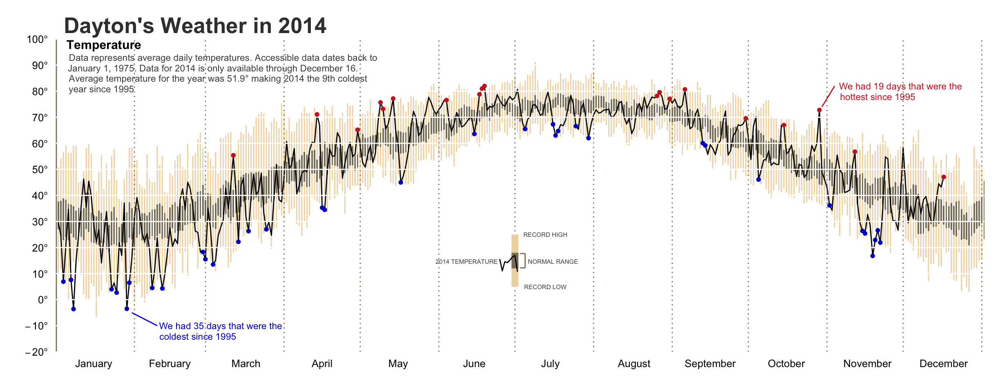

# Key Things to Remember

## ggplot2 provides unlimited visualization customization


<center>

</center>

## What to Remember from this Section

`ggplot2` allows you to:


1. Think about your graphics via layers
2. Apply an organized grammar of graphics for visualization development
3. ...


## What to Remember from this Section

Syntax for ggplot2 visualizations will look like:

```{r, warning=FALSE, message=FALSE, fig.align='center', fig.height=3.25, fig.width=7}
library(ggplot2)

ggplot(data = mpg, aes(x = displ, y = hwy)) +
        geom_point(aes(color = class)) +
        xlab("Engine Displacement (liters)") +
        ylab("Highway Mileage") +
        ggtitle("Fuel Economy vs. Engine Displacement") +
        theme_bw()
        
```


## Resources Used...

Load these packages to follow along with this tutorial

```{r, eval=TRUE}
library(ggplot2)
library(readxl)
library(dplyr)
```

<br>

Import the following data sets from the data folder

```{r, eval=TRUE}
supermarket <- read_excel("data/Supermarket Transactions.xlsx", sheet = "Data")
facebook <- read.delim("data/facebook.tsv")
reddit <- read.csv("data/reddit.csv")
race <- read.csv("data/race-comparison.csv")
```


# Fundamentals of ggplot2

## First Layer is, well, boring

```{r, eval=FALSE}
ggplot(data = supermarket)
ggplot(data = supermarket, aes(x = `Purchase Date`, y = Revenue))
```


```{r, fig.align='center', echo=FALSE, fig.width=10, fig.height=4}
library(gridExtra)

p1 <- ggplot(data = supermarket)
p2 <- ggplot(data = supermarket, aes(x = `Purchase Date`, y = Revenue))

grid.arrange(p1, p2, ncol = 2)
```

## Let's Add Geoms

To display the data we need to tell ggplot what to draw

-----------------       ----------------------------------     
`geom_histogram()`      histogram
`geom_freqpoly()`       frequency polygon
`geom_bar()`            bar chart
`geom_point()`          scatter plot
`geom_line()`           line chart
`geom_boxplot()`        boxplot
-----------------       ----------------------------------

<br>

Check out all the available geoms at [docs.ggplot2.org/current](docs.ggplot2.org/current)


# Univariate Geoms

## Histogram, Frequency Polygons & Density Plots

```{r, eval=FALSE}
ggplot(data = supermarket, aes(x = Revenue)) +
        geom_histogram()

ggplot(data = supermarket, aes(x = Revenue)) +
        geom_freqpoly()

ggplot(data = supermarket, aes(x = Revenue)) +
        geom_density()
```

```{r, echo=FALSE, fig.align='center', fig.width=10, fig.height=3, warning=FALSE, message=FALSE}
p1 <- ggplot(data = supermarket, aes(x = Revenue)) +
        geom_histogram()

p2 <- ggplot(data = supermarket, aes(x = Revenue)) +
        geom_freqpoly()

p3 <- ggplot(data = supermarket, aes(x = Revenue)) +
        geom_density()

grid.arrange(p1, p2, p3, ncol = 3)
```

## Histogram, Frequency Polygons & Density Plots

```{r, eval=FALSE}
ggplot(data = supermarket, aes(x = Revenue)) +
        geom_histogram(bins = 100, color = "grey40", fill = "white")

ggplot(data = supermarket, aes(x = Revenue)) +
        geom_freqpoly(bins = 100, color = "blue")

ggplot(data = supermarket, aes(x = Revenue)) +
        geom_density(fill = "red", alpha = .5)
```

```{r, echo=FALSE, fig.align='center', fig.width=10, fig.height=3, warning=FALSE, message=FALSE}
p1 <- ggplot(data = supermarket, aes(x = Revenue)) +
        geom_histogram(bins = 100, color = "grey40", fill = "white")

p2 <- ggplot(data = supermarket, aes(x = Revenue)) +
        geom_freqpoly(bins = 100, color = "blue")

p3 <- ggplot(data = supermarket, aes(x = Revenue)) +
        geom_density(fill = "red", alpha = .5)

library(gridExtra)
grid.arrange(p1, p2, p3, ncol = 3)
```


## Bar Chart


```{r, eval=FALSE}
ggplot(data = supermarket, aes(x = `Product Family`)) +
        geom_bar()

summary <- supermarket %>%
        group_by(`Product Family`) %>%
        tally()

ggplot(data = summary, aes(x = `Product Family`, y = n)) +
        geom_bar(stat = "identity")
```

```{r, echo=FALSE, fig.align='center', fig.width=8, fig.height=3, warning=FALSE, message=FALSE}
p1 <- ggplot(data = supermarket, aes(x = `Product Family`)) +
        geom_bar()

summary <- supermarket %>%
        group_by(`Product Family`) %>%
        tally()

p2 <- ggplot(data = summary, aes(x = `Product Family`, y = n)) +
        geom_bar(stat = "identity")

grid.arrange(p1, p2, ncol = 2)
```

## Bar Chart
```{r, eval=FALSE}
ggplot(data = supermarket, aes(x = `Product Family`)) +
        geom_bar(fill = "dodgerblue", color = "grey40")

ggplot(data = supermarket, aes(x = `Product Family`)) +
        geom_bar(fill = "dodgerblue", color = "grey40", width = .75)

ggplot(data = supermarket, aes(x = `Product Family`)) +
        geom_bar(fill = "dodgerblue", color = "grey40", width = .99)
```

```{r, echo=FALSE, fig.align='center', fig.width=10, fig.height=3, warning=FALSE, message=FALSE}
p1 <- ggplot(data = supermarket, aes(x = `Product Family`)) +
        geom_bar(fill = "dodgerblue", color = "grey40")

p2 <- ggplot(data = supermarket, aes(x = `Product Family`)) +
        geom_bar(fill = "dodgerblue", color = "grey40", width = .75)

p3 <- ggplot(data = supermarket, aes(x = `Product Family`)) +
        geom_bar(fill = "dodgerblue", color = "grey40", width = .99)

grid.arrange(p1, p2, p3, ncol = 3)
```


## Your Turn

<br>
<br>

<blockquote>
<font size="6">
1. Assess the distribution of age, tenure, and gender in the `facebook` data.
</font>
</blockquote>

<br>

<blockquote>
<font size="6">
2. Assess the frequency of age range, education, and income range in the `reddit` data. 
</font>
</blockquote>


# Bivariate Geoms

## Scatter Plots

```{r, eval=FALSE}
ggplot(supermarket, aes(`Purchase Date`, Revenue)) +
        geom_point()

ggplot(supermarket, aes(`Purchase Date`, Revenue)) +
        geom_point(colour = "blue", size = 1, shape = 5)

ggplot(supermarket, aes(`Purchase Date`, Revenue)) +
        geom_point(colour = "blue", alpha = .25)
```

```{r, echo=FALSE, fig.align='center', fig.width=10, fig.height=3, warning=FALSE, message=FALSE}
p1 <- ggplot(supermarket, aes(`Purchase Date`, Revenue)) +
        geom_point()

p2 <- ggplot(supermarket, aes(`Purchase Date`, Revenue)) +
        geom_point(colour = "blue", size = .5, shape = 5)

p3 <- ggplot(supermarket, aes(`Purchase Date`, Revenue)) +
        geom_point(colour = "blue", alpha = .05)

grid.arrange(p1, p2, p3, ncol = 3)
```

## Scatter Plots: over plotting

```{r, eval=FALSE}
ggplot(supermarket, aes(factor(`Units Sold`), Revenue)) +
        geom_point()

ggplot(supermarket, aes(factor(`Units Sold`), Revenue)) +
        geom_jitter(size = 1)

ggplot(supermarket, aes(factor(`Units Sold`), Revenue)) +
        geom_jitter(size = 1, alpha = .1)
```

```{r, echo=FALSE, fig.align='center', fig.width=10, fig.height=3, warning=FALSE, message=FALSE}
p1 <- ggplot(supermarket, aes(factor(`Units Sold`), Revenue)) +
        geom_point()

p2 <- ggplot(supermarket, aes(factor(`Units Sold`), Revenue)) +
        geom_jitter(size = 1)

p3 <- ggplot(supermarket, aes(factor(`Units Sold`), Revenue)) +
        geom_jitter(size = 1, alpha = .1)

grid.arrange(p1, p2, p3, ncol = 3)
```

## Line Charts

```{r, eval=FALSE}
sales_by_date <- supermarket %>%
        group_by(`Purchase Date`) %>%
        summarise(Revenue = sum(Revenue, na.rm = TRUE))

ggplot(sales_by_date, aes(`Purchase Date`, Revenue)) +
        geom_line()
```

```{r, echo=FALSE, fig.align='center', fig.width=10, fig.height=4, warning=FALSE, message=FALSE}
sales_by_date <- supermarket %>%
        group_by(`Purchase Date`) %>%
        summarise(Revenue = sum(Revenue, na.rm = TRUE))

ggplot(sales_by_date, aes(`Purchase Date`, Revenue)) +
        geom_line()
```

## Line Charts: fitting additional lines

```{r, eval=FALSE}
sales_plot <- ggplot(sales_by_date, aes(`Purchase Date`, Revenue)) +
        geom_line()

sales_plot + geom_smooth(span = .1)

sales_plot + geom_smooth(span = .9. se = FALSE)

sales_plot + geom_smooth(method = "lm", se = FALSE)
```

```{r, echo=FALSE, fig.align='center', fig.width=10.5, fig.height=3.5, warning=FALSE, message=FALSE}
sales_plot <- ggplot(sales_by_date, aes(`Purchase Date`, Revenue)) +
        geom_line()

p1 <- sales_plot + geom_smooth(span = .1)

p2 <- sales_plot + geom_smooth(span = .9, se = FALSE)

p3 <- sales_plot + geom_smooth(method = "lm", se = FALSE)

grid.arrange(p1, p2, p3, ncol = 3)
```

## Box Plot

```{r, eval=FALSE}
ggplot(supermarket, aes(factor(Children), Revenue)) +
        geom_boxplot()

ggplot(supermarket, aes(factor(Children), Revenue)) +
        geom_boxplot(notch = TRUE, fill = "blue", alpha = .25)

ggplot(supermarket, aes(factor(Children), Revenue)) +
        geom_boxplot(outlier.color = "red", outlier.shape = 1)
```

```{r, echo=FALSE, fig.align='center', fig.width=10, fig.height=3, warning=FALSE, message=FALSE}
p1 <- ggplot(supermarket, aes(factor(Children), Revenue)) +
        geom_boxplot()

p2 <- ggplot(supermarket, aes(factor(Children), Revenue)) +
        geom_boxplot(notch = TRUE)

p3 <- ggplot(supermarket, aes(factor(Children), Revenue)) +
        geom_boxplot(outlier.color = "red", outlier.shape = 1)

grid.arrange(p1, p2, p3, ncol = 3)
```

## Box Plot: over plotting

Useful for smaller data sets like `mpg`

```{r, eval=FALSE}
ggplot(mpg, aes(class, hwy)) +
        geom_boxplot()

ggplot(mpg, aes(class, hwy)) +
        geom_boxplot() +
        geom_jitter(width = .2, alpha = .5)

ggplot(mpg, aes(class, hwy)) +
        geom_violin()
```

```{r, echo=FALSE, fig.align='center', fig.width=10, fig.height=3, warning=FALSE, message=FALSE}
p1 <- ggplot(mpg, aes(class, hwy)) +
        geom_boxplot()

p2 <- ggplot(mpg, aes(class, hwy)) +
        geom_boxplot() +
        geom_jitter(width = .2, alpha = .5)

p3 <- ggplot(mpg, aes(class, hwy)) +
        geom_violin()

grid.arrange(p1, p2, p3, ncol = 3)
```


## Bar Chart

Bar charts can have additional y-axis rather than just counts

```{r, eval=FALSE}
ggplot(supermarket, aes(x = `Product Family`)) +
        geom_bar()

prod_revenue <- supermarket %>%
        group_by(`Product Family`) %>%
        summarise(Revenue = sum(Revenue, na.rm = TRUE))

ggplot(prod_revenue, aes(x = `Product Family`, y = Revenue)) +
        geom_bar(stat = "identity")
```

```{r, echo=FALSE, fig.align='center', fig.width=8, fig.height=3, warning=FALSE, message=FALSE}
p1 <- ggplot(data = supermarket, aes(x = `Product Family`)) +
        geom_bar()

prod_revenue <- supermarket %>%
        group_by(`Product Family`) %>%
        summarise(Revenue = sum(Revenue, na.rm = TRUE))

p2 <- ggplot(prod_revenue, aes(x = `Product Family`, y = Revenue)) +
        geom_bar(stat = "identity")

grid.arrange(p1, p2, ncol = 2)
```


## Your Turn

<br>
<br>

<blockquote>
<font size="6">
Assess the relationship between tenure and age, gender, likes, etc. in the `facebook` data.
</font>
</blockquote>


# Multivariate Capabilities

## Color, Size, Shape, etc.

## Facetting


# Visualization Aesthetics

## Scales, Axes and Legends

## Themes


