## because...

<br>

<blockquote>
<font size="7">
*"Data sets contain more information than they display."*
</font>
</blockquote>

<br>

<p align="right">
<font size="6">
- Garrett Grolemund &nbsp;&nbsp;&nbsp;&nbsp;&nbsp;&nbsp;&nbsp;&nbsp;&nbsp;&nbsp;&nbsp;&nbsp;&nbsp;&nbsp;&nbsp;&nbsp;&nbsp;&nbsp;&nbsp;&nbsp;
</font>
</p>


# Key Things to Remember

## What to Remember from this Section

<font size="6">
`dplyr` is a package that transforms and manipulates data
</font>

<br>

<font size="5">[`select()`](#11): select variables of concern</font>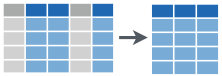

<br>

<font size="5">[`filter()`](#18): filter values based on conditions</font>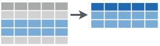

<br>

<font size="5">[`group_by()`](#24): group data by categorical levels</font>

<br>

<font size="5">[`summarise()`](#31): change unit of analysis</font>

<br>

<font size="5">[`arrange()`](#41): order the data</font>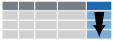

## What to Remember from this Section

<font size="6">
`dplyr` is a package that transforms and manipulates data
</font>

<br>

<font size="5">[`mutate()`](#45): create new variables</font>

<br>

<font size="5">[`join()`](#52): combine separate data sets</font>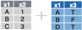

# GR&A | That means grounds rules & assumptions

## R package used...

<br><br><br>

<center>
<font size="7" color="#d6d6d6">
install.packages("dplyr")
</font>
</center>

<br>

<center>
<font size="7">
library(dplyr)
</font>
</center>

```{r, echo=FALSE, warning=FALSE, message=FALSE}
library(dplyr)
```


## data used...

<br><br><br>

<center>
<font size="7" color="#d6d6d6">
install.packages("EDAWR")
</font>
</center>

<br>

<center>
<font size="7">
library(EDAWR)
</font>
</center>

<br>
<br>
<center>
<font size="6">
Data sets:</font> <font size="6" color="000000">storms, tb, pollution, iris, a, b</font>
</font>
</center>

## %>% operator... | learn it, love it, leverage it

<ul>
  <li><font size="5"><a href="https://cran.r-project.org/web/packages/magrittr/index.html">magrittr</a> &#8594; <a href="https://twitter.com/stefanbache">Stefan Milton Bache</a></font>
  <li><font size="5">not required but extremely convenient</font>
</ul>  
<br><br>
<center>filter(data, variable == *numeric_value*)</center>
<br>
<center><u>*or*</u></center>
<br>
<center>data <mark>%>%</mark> filter(variable == *numeric_value*)</center>

## %>% operator... | learn it, love it, leverage it

```{r, echo=TRUE, eval=FALSE}
arrange(
        summarize(
                filter(data, variable == "numeric_value"),
                Total = sum(variable)
        ),
        desc(Total)
)
```

```{r, echo=TRUE, eval=FALSE}
a <- filter(data, variable == "numeric_value")
b <- summarise(a, Total = sum(variable))
c <- arrange(b, desc(Total))
```

```{r, echo=TRUE, eval=FALSE}
data %>%
        filter(variable == "value") %>%
        summarise(Total = sum(variable)) %>%
        arrange(desc(Total))
```

<center>*Same results but the %>% operator is more efficient and legible*</center>  


# select( ) | Select variables of concern

## select( )

<center>
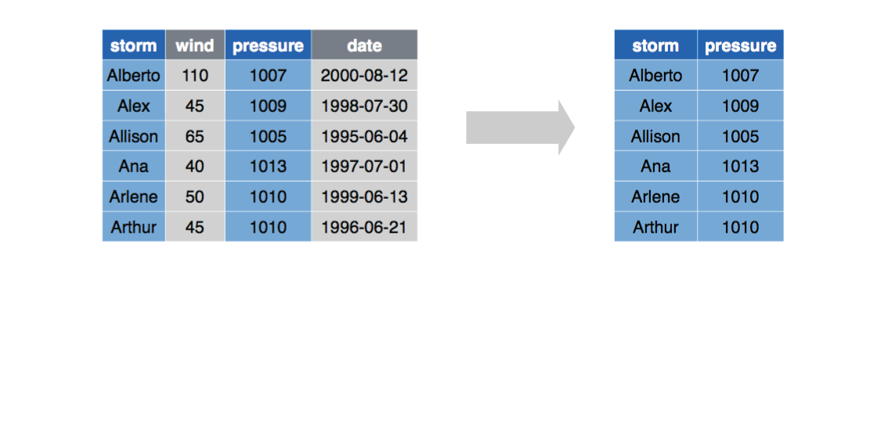
</center>

## select( )

<center>
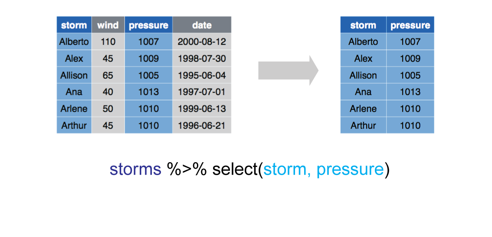
</center>

## select( )

<center>
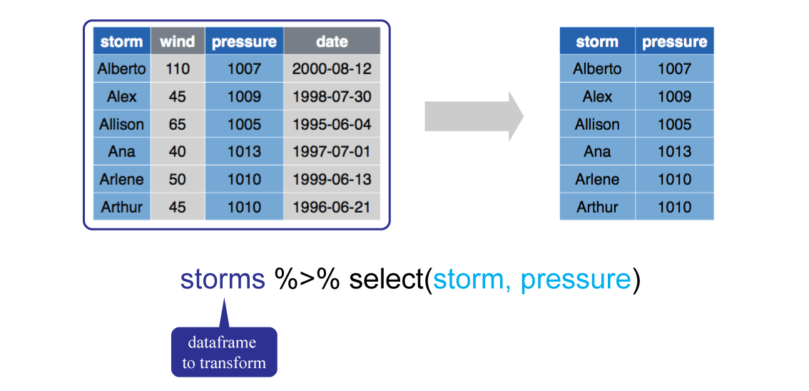
</center>

## select( )

<center>
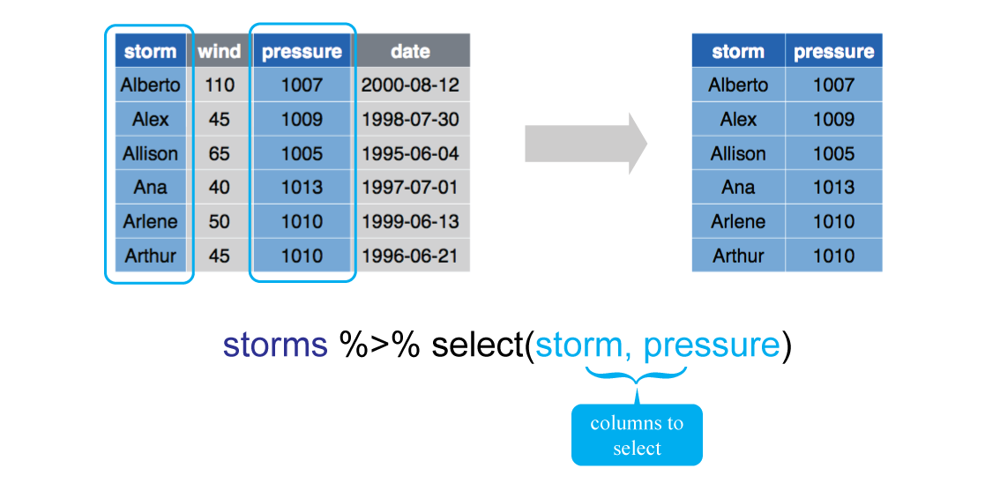
</center>


## select( )

Code alternatives:
```{r, echo=TRUE, eval=FALSE}
These produce the same results:
        storms %>% select(wind, pressure, date)
        storms %>% select(wind:pressure)
        storms %>% select(-storm)
```

<center>
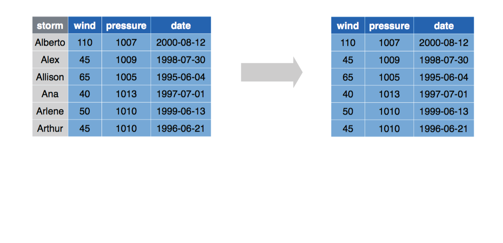
</center>

## Your Turn

<br>

<font size="6">
Import the `facebook.tsv` file in the data folder
</font>

<br>

<blockquote>
<font size="6">
Create a new data frame that includes: <br>

<li>userid</li>
<li>age</li>
<li>gender</li>
<li>friend_count</li>
</font>
</blockquote>


# filter( ) | Filter values based on defined conditions

## filter( )

<center>
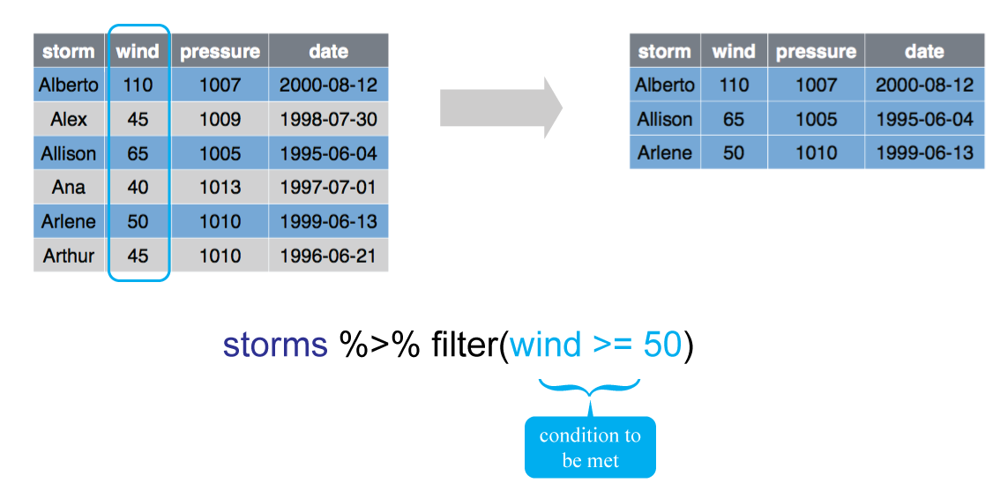
</center>

## filter( )

<center>
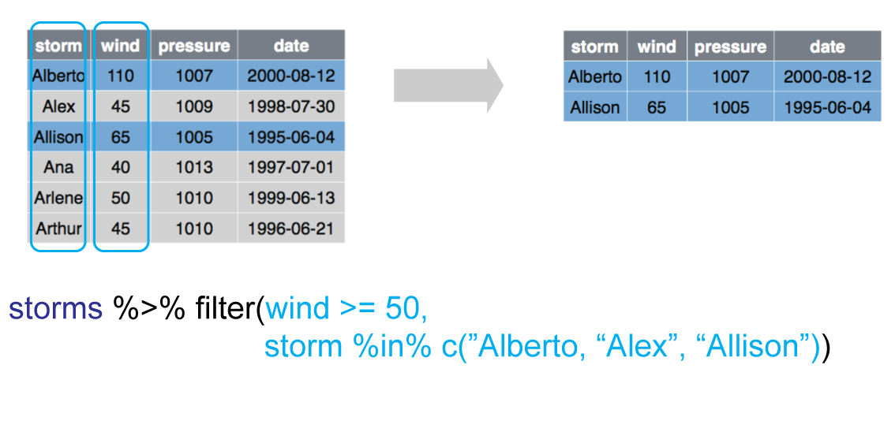
</center>

<center>*Can filter for multiple conditions*</center> 

## filter( )

We can apply multiple logic rules in the `filter()` function such as:

------  --------------------      -------       -------------------
  <     Less than                   !=          Not equal to
  >     Greater than                %in%        Group membership
  ==    Equal to                    is.na       is NA
  !=    Not equal to               !is.na       is not NA
  <=    Less than or equal to       &,|,!       Boolean operators
  >=    Greater than or equal to
------  --------------------      -------       -------------------

## filter( )

Additional subsetting functions:

--- -------------------------------------------   --------------------------------
    storms %>% `distinct()`                       Remove duplicate rows
    storms %>% `sample_frac(0.5, replace = TRUE)` Randomly select fraction of rows
    storms %>% `sample_n(10, replace = TRUE)`     Randomly select n rows
    storms %>% `slice(3:5)`                       Select rows by position
    storms %>% `top_n(storms, 2, date)`           Select and order top n entries
--- -------------------------------------------   --------------------------------


## Your Turn

<br>

<font size="6">
Continuing with our `facebook.tsv` data...
</font>

<br>

<blockquote>
<font size="6">
1. Filter the facebook data for just males
</font>
</blockquote>

<br>

<blockquote>
<font size="6">
2. Select the following variables: <br>

<li>userid</li>
<li>age</li>
<li>gender</li>
<li>friend_count</li>
<br>
...and then filter for just males
</font>
</blockquote>


# group_by( ) | Group data by categorical levels

## group_by( )

<center>
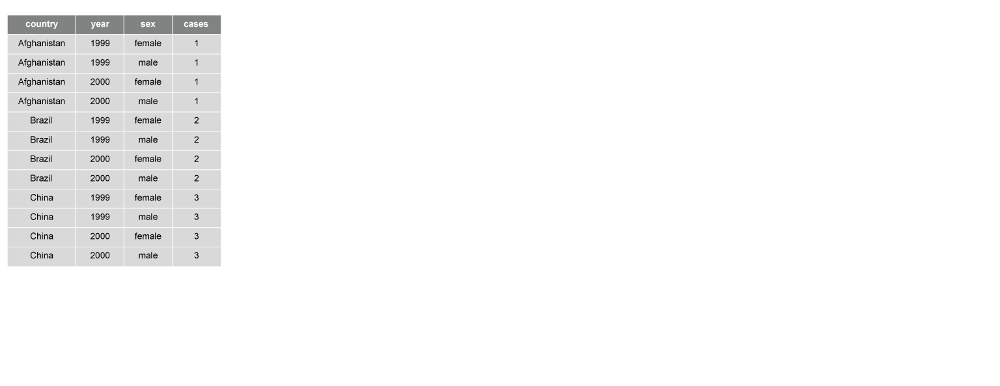
</center>


## group_by( )

<center>
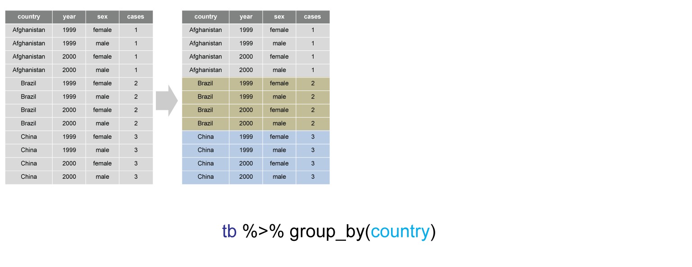
</center>

## group_by( )

<center>
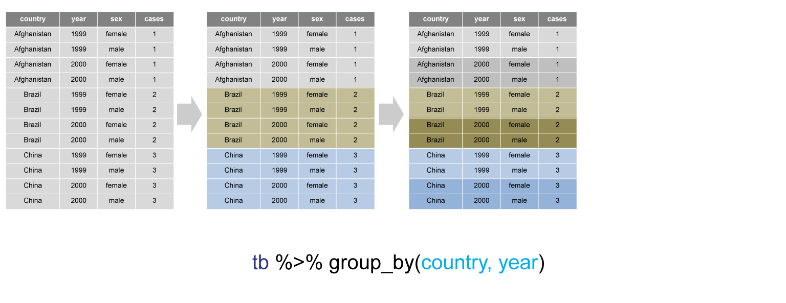
</center>

## group_by( )

<center>
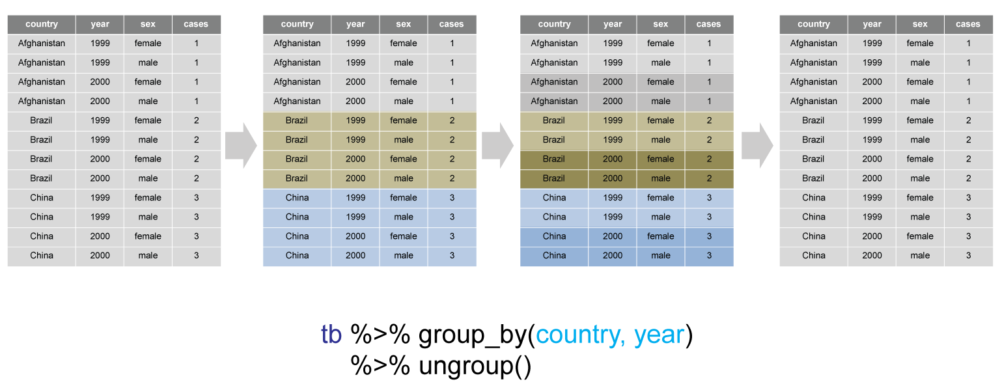
</center>

## group_by( )

- `group_by()` function is a <u>*silent*</u> function in which no observable manipulation of the data occurs
- Alters underlying attributes &#8594; note <font color="blue">Groups: city [3]</font> in output below
- Becomes useful when combined with other functions

```{r, echo=FALSE, message=FALSE}
library(EDAWR)
library(dplyr)
```

```{r, echo=TRUE, message=FALSE}
pollution %>% group_by(city)        
``` 

## Your Turn

<br>

<font size="6">
Continuing with our `facebook.tsv` data...
</font>

<br>

<blockquote>
<font size="6">
Select the following variables: <br>

<li>userid</li>
<li>age</li>
<li>gender</li>
<li>friend_count</li>
<br>
...and then group by gender
</font>
</blockquote>


# summarise( ) | Change unit of analysis

## summarise( )

<center>
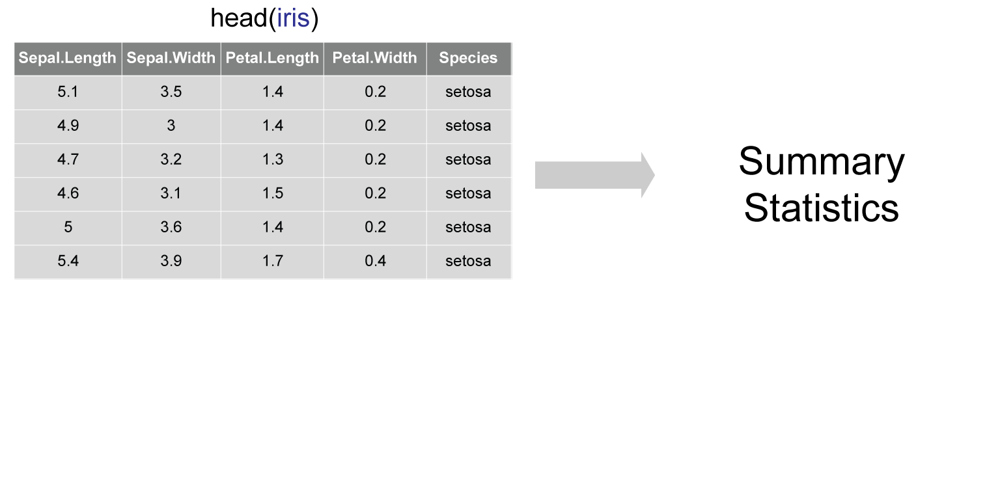
</center>

## summarise( )

<center>
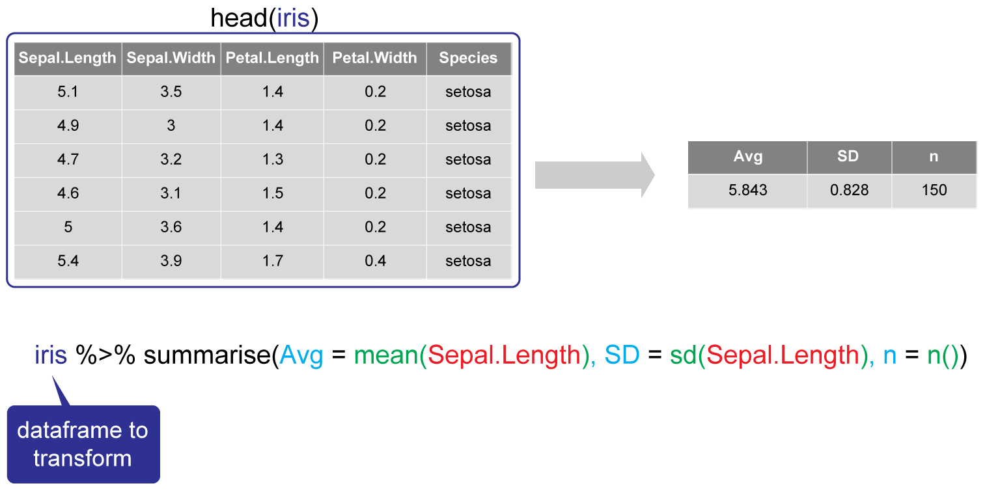
</center>

## summarise( )

<center>
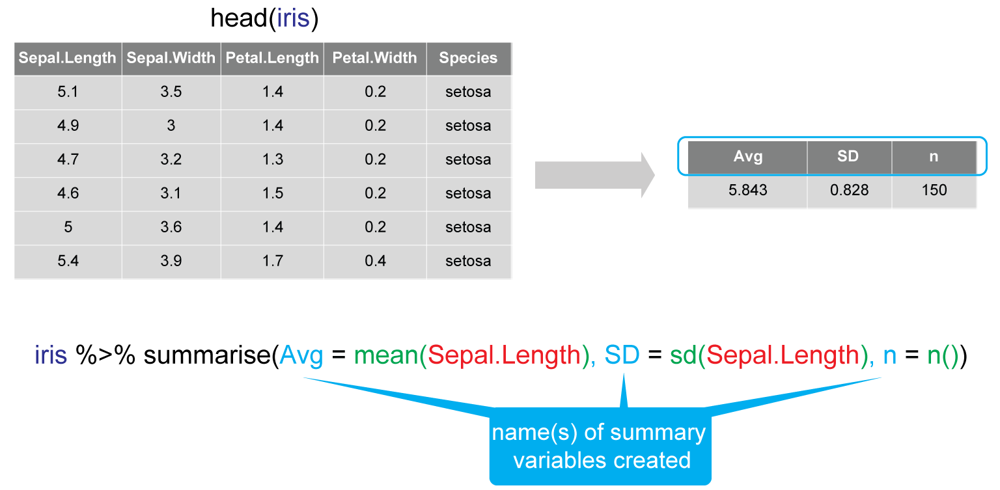
</center>

## summarise( )

<center>
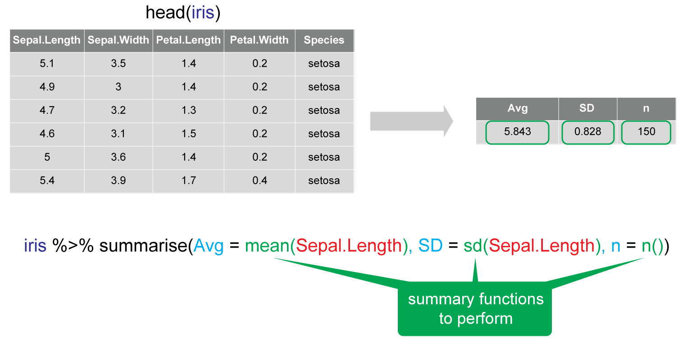
</center>

## summarise( )

<center>
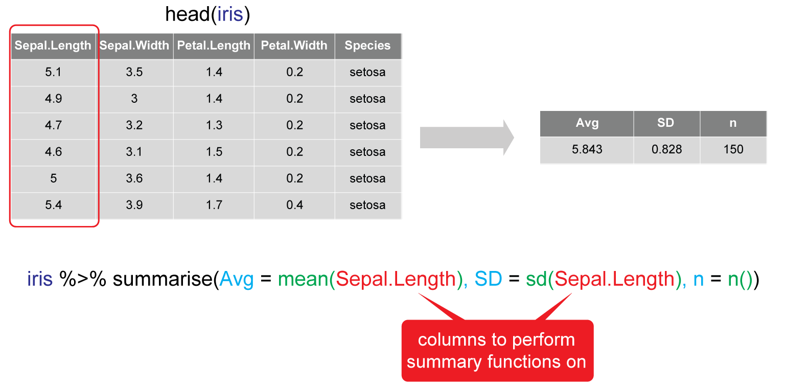
</center>

## summarise( )

<center>
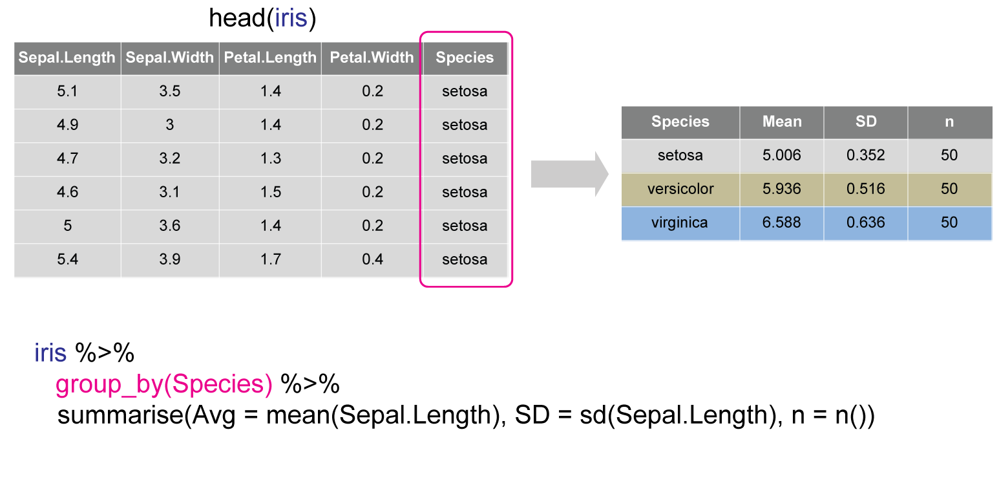
</center>


## summarise( )

<center>
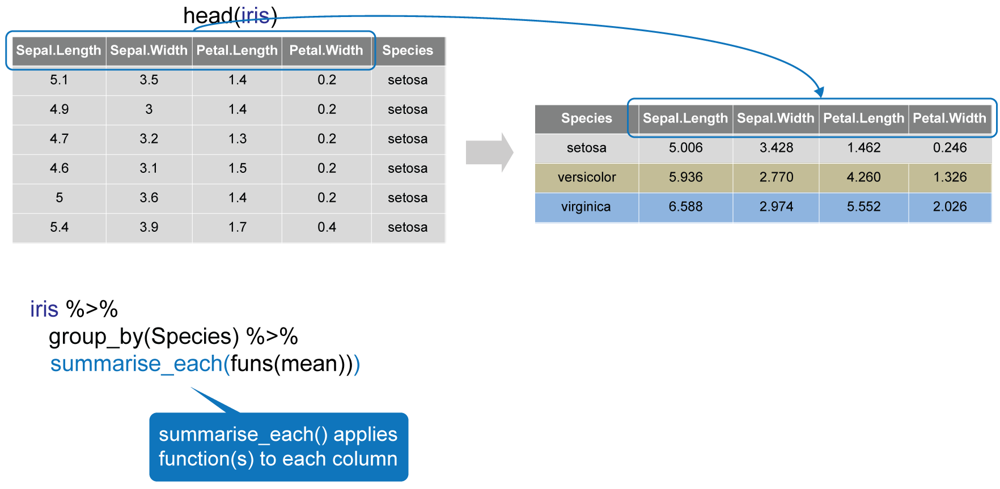
</center>

## summarise( )

Summary functions:

- ----------      -----------------------        -------         ----------------------
  `first()`       First value of a vector        `min()`         Min value in vector
  `last()`        Last value of a vector         `max()`         Max value in vector
  `nth()`         Nth value of a vector          `mean()`        Mean value of vector
  `n()`           # of values in a vector        `median()`      Median value of vector
  `n_distinct()`  # of distinct values           `var()`         Variance of vector
  `IQR()`         IQR of a vector                `sd()`          St. dev. of vector
- ----------      ------------------------       -------         ----------------------

## Your Turn

<font size="6">
Continuing with our `facebook.tsv` data...
</font>

<br>

<blockquote>
<font size="6">
1. Calculate the mean and median for `tenure` and `friend_count`
</font>
</blockquote>

<br>

<blockquote>
<font size="6">
2. Select the following variables: <br>

<li>gender</li>
<li>age</li>
<li>friend_count</li>
<br>
group by gender and calculate the mean and median for `age` and `friend_count`
</font>
</blockquote>


# arrange( ) | Order data

## arrange( )

<center>
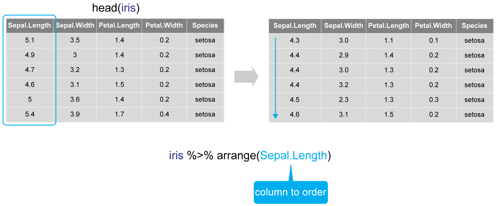
</center>

## arrange( )

<center>
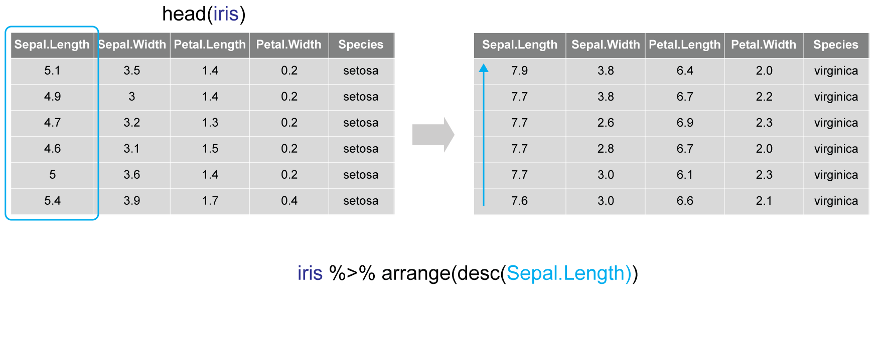
</center>

<center>*Use `desc(x)` to sort variable(s) in descending order*</center>

## Your Turn

<font size="6">
Continuing with our `facebook.tsv` data...
</font>

<br>

<blockquote>
<font size="6">
1. Group the data by `age`
</font>
</blockquote>

<br>

<blockquote>
<font size="6">
2. Calculate the median `friend_count` for each age
</font>
</blockquote>

<br>

<blockquote>
<font size="6">
3. Arrange the median calculated `friend_count` variable in descending order to find the ages with the greatest median friend count
</font>
</blockquote>


# mutate( ) | Create new variables

## mutate( )

<center>
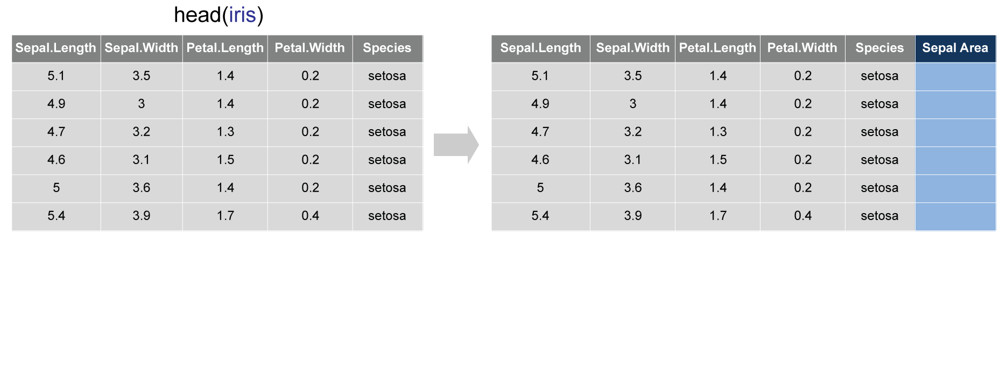
</center>

## mutate( )

<center>
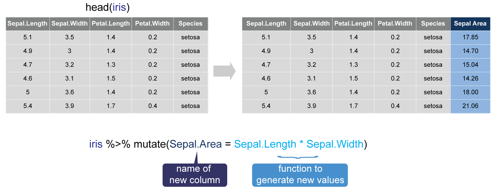
</center>

## mutate( )

<center>
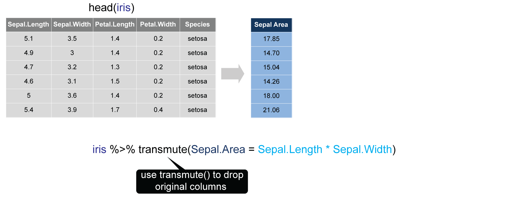
</center>

## mutate( )

<center>
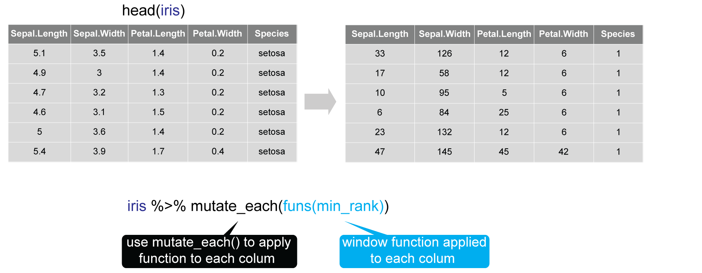
</center>

## mutate( )

Window functions that can be applied within `mutate_each(funs())`:

- -----------------     ------------------      ----------------     
  `lead()`              `ntile()`               `cumsum()`
  `lag()`               `between()`             `cummax()`
  `dense_rank()`        `cume_dist()`           `cummin()`
  `min_rank()`          `cumall()`              `cumprod()`
  `percent_rank()`      `cumany()`              `pmax()`
  `row_number()`        `cumean()`              `pmin()`
- -----------------     ------------------      ----------------

<br>

- Can also create own functions to pass through `mutate_each(funs())`
- Be aware that some functions will cause errors when applied to non-numeric variables

## Your Turn

<font size="6">
Continuing with our `facebook.tsv` data...
</font>

<br>

<blockquote>
<font size="6">
1. Create a new variable `friend_ratio` that equals <br>

$$\text{friend_ratio} = \frac{\text{friendships_initiated}}{\text{friend_count}}$$
</font>
</blockquote>

<br>

<blockquote>
<font size="6">
2. Find the median `friend_ratio` for males and females.
</font>
</blockquote>


# join( ) | Combine separate data sets

## join( )

<center>
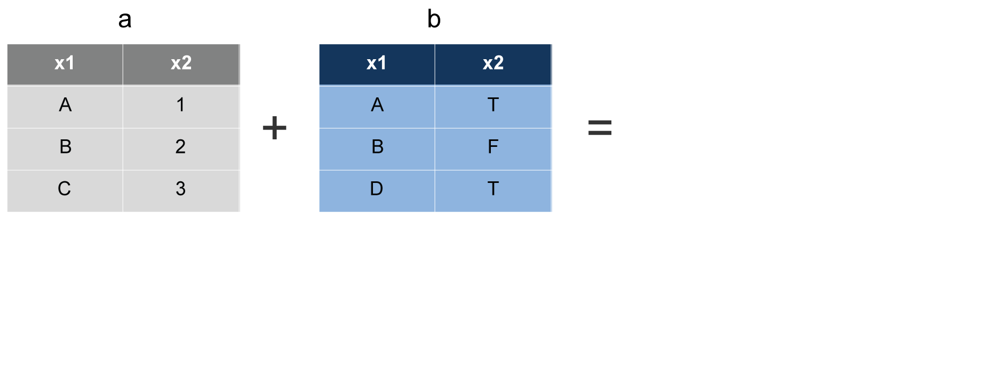
</center>

## join( )

<center>
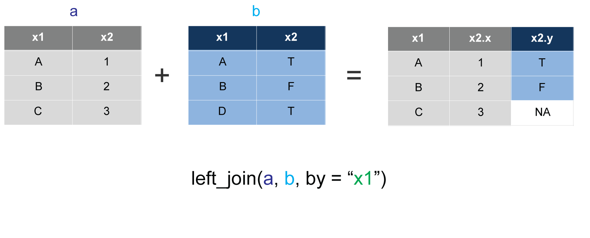

*Join matching rows from `b` to `a`*
</center>

## join( )

<center>
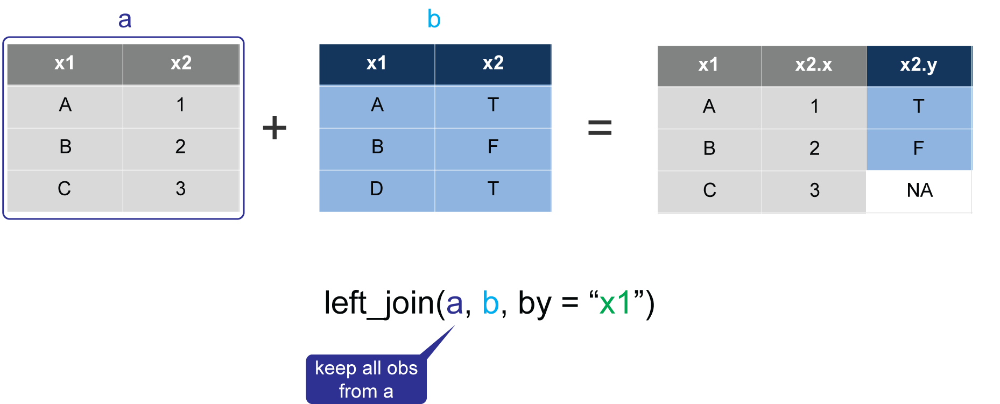

*Join matching rows from `b` to `a`*
</center>

## join( )

<center>
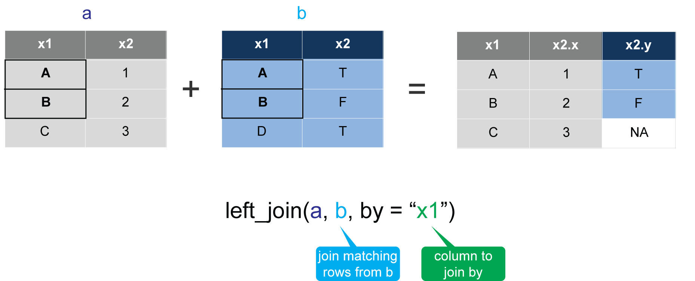

*Join matching rows from `b` to `a`*
</center>

## join( )

<center>
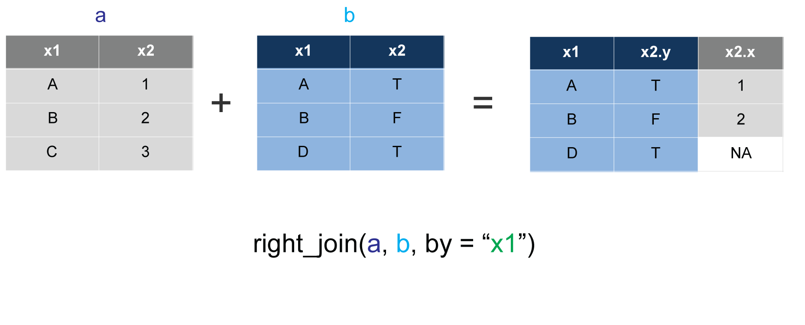

*Join matching rows from `a` to `b`*
</center>

## join( )

<center>
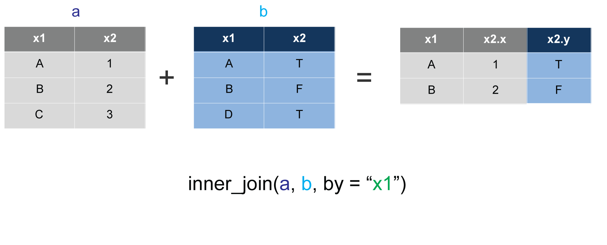

*Join data. Retain only matching rows in both sets.*
</center>

## join( )

<center>
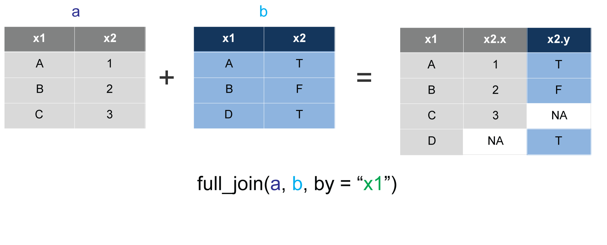

*Join data. Retain all values, all rows.*
</center>

## join( )

<center>
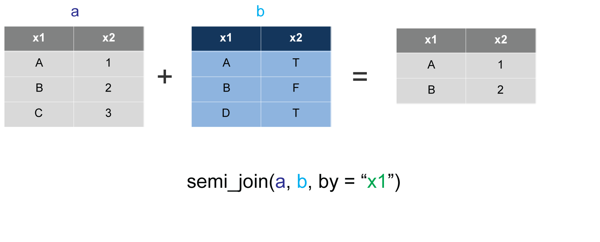

*Keep all rows in `a` that have a match in `b`.*
</center>

## join( )

<center>
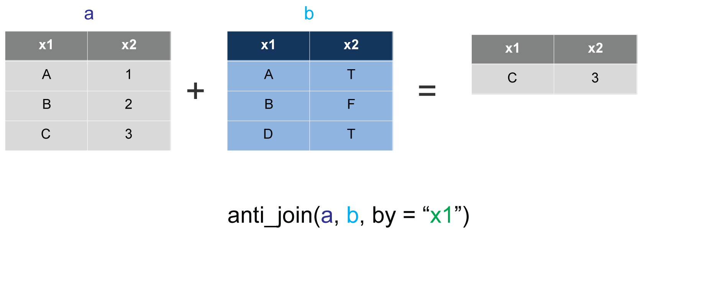

*Keep all rows in `a` that do <u>not</u> have a match in `b`.*
</center>

## join( )

Additional `dplyr` functions for merging data sets:

- -----------------     ----------------------------------     
  `intersect(y, z)`     Rows that appear in both y and z
  `union(y, z)`         Rows that appear in either or both y and z
  `setdiff(y, z)`       Rows that appear in y but not z
  `bind_rows(y, z)`     Append z to y as new rows
  `bind_cols(y, z)`     Append z to y as new columns
- -----------------     ----------------------------------

<br>

<center>
*Use extreme caution when applying `bind_` functions.*
</center>

## Your Turn

<br>

<font size="6">
Import the `reddit.csv` and `regions.csv` files in the data folder
</font>

<br>

<blockquote>
<font size="6">
Join the `regions` data to the `reddit` data
</font>
</blockquote>

<br><br><br><br><br><br><br><br><br><br>

**HINT:** the common variable between the two data frames is `state`


# Key Things to Remember

## Remember These Functions!

<font size="6">
`dplyr` is a package that transforms and manipulates data
</font>

<br>

<font size="5">[`select()`](#11): select variables of concern</font>

<br>

<font size="5">[`filter()`](#19): filter values based on conditions</font>

<br>

<font size="5">[`group_by()`](#27): group data by categorical levels</font>

<br>

<font size="5">[`summarise()`](#35): change unit of analysis</font>

<br>

<font size="5">[`arrange()`](#46): order the data</font>

## Remember These Functions!

<font size="6">
`dplyr` is a package that transforms and manipulates data
</font>

<br>

<font size="5">[`mutate()`](#51): create new variables</font>

<br>

<font size="5">[`join()`](#59): combine separate data sets</font>


## Break {.flexbox .vcenter}

<div class="centered">

<font size="10">5 minutes!</font>

</div>

